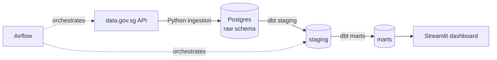

# 🏠 SG HDB Resale Pipeline

An end-to-end ELT pipeline that ingests Singapore HDB resale flat transactions from [data.gov.sg](https://data.gov.sg), models them with dbt in a Postgres warehouse, orchestrates daily runs with Airflow, and serves insights through a dashboard.

> **Status:** 🚧 In progress. See [Roadmap](#roadmap).

---

<!--## Why this project -->

<!-- 2–3 sentences in your own words. E.g.: HDB resale prices are a hot topic in Singapore.
I wanted to answer questions like "which towns saw the fastest price growth?" while
practising a production-style data stack: containerised services, tested transformations
and scheduled orchestration. -->

## Architecture



<!-- Later: replace with a proper diagram in docs/architecture.png (excalidraw.com works well) -->

## Tech stack

| Layer | Tool |
|---|---|
| Ingestion | Python (`requests`, `psycopg`) |
| Storage | PostgreSQL 17 (Docker) |
| Transformation | dbt Core (`dbt-postgres`) |
| Metrics / semantic layer | MetricFlow |
| Orchestration | Apache Airflow 3 (Docker) |
| Dashboard | Streamlit |
| Env / packaging | Docker Compose, uv |
| CI | GitHub Actions |

## Data source

- **Dataset:** HDB Resale Flat Prices (Jan 2017 onwards), ~240k rows, updated monthly
- **API:** `https://data.gov.sg/api/action/datastore_search?resource_id=d_8b84c4ee58e3cfc0ece0d773c8ca6abc`
- **Fields:** month, town, flat_type, block, street_name, storey_range, floor_area_sqm, flat_model, lease_commence_date, remaining_lease, resale_price

## Data model

<!-- Fill in once dbt models exist. Example:
- `stg_hdb_resale`: cleaned types, parsed remaining_lease into months, price_per_sqm
- `fct_resale_transactions`: one row per transaction
- `dim_town`, `dim_flat_type`
- `mart_town_monthly_prices`: median price & price/sqm by town x flat_type x month
-->

## Project structure

```
├── docker-compose.yml     # warehouse + (optional) Airflow
├── .env.example           # copy to .env
├── ingestion/             # Python scripts: API -> raw schema
├── dbt/                   # dbt project: staging -> marts, with tests
├── dags/                  # Airflow DAGs
├── dashboard/             # Streamlit app
├── tests/                 # pytest for ingestion code
└── docs/                  # diagrams, screenshots
```

## Quickstart

**Prerequisites:** Docker Desktop, [uv](https://docs.astral.sh/uv/), git

```bash
git clone https://github.com/<your-username>/sg-hdb-resale-pipeline.git
cd sg-hdb-resale-pipeline
cp .env.example .env            # then edit the password

# 1. Start the warehouse
docker compose up -d

# 2. Load raw data
uv run python ingestion/load_hdb_resale.py

# 3. Build dbt models
cd dbt && uv run dbt build

# 4. (Optional) Start Airflow -> http://localhost:8080
docker compose --profile airflow up -d
```

## Roadmap

- [ ] **Phase 1: Ingestion.** Postgres in Docker; Python script loads API data into `raw.hdb_resale` (pagination, idempotent reloads)
- [ ] **Phase 2: Transformation.** dbt staging + marts; `not_null` / `unique` / `accepted_values` tests; dbt docs
- [ ] **Phase 3: Advanced dbt.** Incremental models (new months only), snapshots (SCD Type 2), seeds (town → region mapping), macros, model contracts, unit tests
- [ ] **Phase 4: Semantic layer.** MetricFlow metrics (`median_resale_price`, `price_per_sqm`, `transaction_count`) queried by town / flat type / month with `mf query`
- [ ] **Phase 5: Orchestration.** Airflow DAG: ingest → dbt build, scheduled monthly
- [ ] **Phase 6: Serving.** Streamlit dashboard reading from marts / metrics
- [ ] **Phase 7: Quality & CI.** GitHub Actions running lint, pytest and `dbt build` on every push

## Key insights

<!-- 2–3 findings from your dashboard, with a screenshot. Interviewers love this section. -->

## What I learned / design decisions

<!-- Most valuable section for interviews. E.g.:
- Why ELT (load raw first) instead of transforming in Python
- How I made ingestion idempotent (safe to re-run)
- Why the Airflow metadata DB is separate from the warehouse
- What I'd change for production (cloud warehouse, secrets manager, CeleryExecutor/K8s)
-->
### Phase 1:

- **Full refresh, not incremental.** Each run truncates and reloads the table in one transaction. The dataset has no reliable unique key and is small (~200k rows), so reloading everything is simpler and always correct; a failed run rolls back to the previous load. Trade-off: it re-downloads all data monthly. Incremental models come in Phase 3, in dbt.

- **ELT instead of ETL** (1) In case there's any issue in the transform steps, we are still able to retrieve the raw data without the need for re-downloading it. (2) Transformations become SQL that's versioned and tested in dbt, rather than logic buried in the Python script. Trade-off:      
    - the raw data is stored in the warehouse alongside the transformed versions;
    - the warehouse does the transformation work;
    - any messy or sensitive data reaches the warehouse unfiltered.


- **download happens before the transaction (the table lock)** Download first, then open the transaction. TRUNCATE locks the table until commit, so this keeps the lock to seconds.

- **raw columns are all TEXT** Storing every value as text means the load never fails on an unexpected value, and all type conversion happens in dbt, where it's tested.

- the load script handles:
  - Knowing when to stop. Stop when a page returns no records, not after a fixed number of pages.
  - Rate limits. data.gov.sg throttles clients that send requests too fast. It will pause briefly between
    pages and retry when the API replies "too many requests" (HTTP 429).
  - Offset drift. Offset pagination can skip or repeat rows if the dataset changes during the download.
    The data only updates monthly and a run takes a minute or two, so this risk is acceptable here.

- encountered password authentication error on the first time of running the loading script:
    - ran lsof -nP -iTCP:5432 -sTCP:LISTEN to narrow down the root cause
    - the command only list a docker process, it ruled out another Postgres instance using port 5432, which pointed to the stale volume as the cause
    - cause: the postgres Docker image applies POSTGRES_USER and POSTGRES_PASSWORD only the first time it starts with an empty data directory. After that, the database lives in the warehouse_data volume, and later changes to .env are ignored. So if the container was ever started before we set the final password (for example while it was still change_me), the database kept that first password.
    - tried to stop the containers and delete their volumes: ```docker compose down -v```
    - then started a fresh container (Postgres initializes again using the password now in .env.): ```docker compose up -d```
    - the resetting was safe as no data had been loaded yet
 
- Safeguards:
  - compares the number of rows fetched with the API's total, before anything is written to the database (completeness check)
  - advancing the offset by rows received, so a smaller page than requested can't silently skip rows.

- Testing: the API client is unit-tested by mocking HTTP responses, so tests run without network access.
