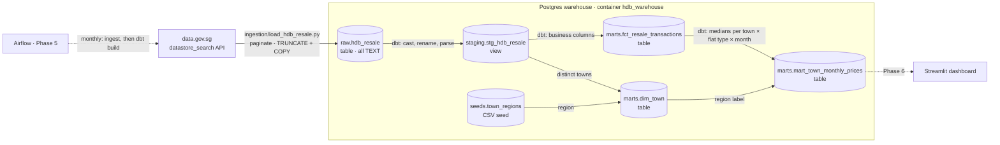

# Architecture

How the pipeline is built today and how the planned phases fit in. The reasons behind each choice are in [decisions.md](decisions.md).

## Data flow



Solid arrows exist today; dotted ones are planned.

## Components

| Component | Where | Status |
|---|---|---|
| Warehouse | `docker-compose.yml` service `warehouse` (Postgres 17, volume `warehouse_data`) | Done |
| Ingestion | `ingestion/load_hdb_resale.py` | Done (Phase 1) |
| Ingestion tests | `tests/test_load_hdb_resale.py` (pytest, API mocked) | Done (Phase 1) |
| dbt project | `dbt/` | In progress (Phase 2) |
| Semantic layer | MetricFlow | Planned (Phase 4) |
| Orchestration | `docker-compose.yml` services `airflow` + `airflow-db` (profile `airflow`); DAGs in `dags/` | Services defined; DAG planned (Phase 5) |
| Dashboard | `dashboard/` (Streamlit) | Planned (Phase 6) |
| CI | GitHub Actions | Planned (Phase 7) |

## Warehouse layers

The warehouse database has one schema per layer. Each layer only reads from the one before it.

| Schema | Built by | Materialization | Purpose |
|---|---|---|---|
| `raw` | Python loader | table | Source data exactly as the API returned it, plus `_loaded_at`. Full-refreshed on every load. |
| `staging` | dbt (`models/staging/`) | view | One model per source table: rename, cast types, parse text fields. No joins or aggregation. |
| `marts` | dbt (`models/marts/`) | table | Business-facing models the dashboard reads: facts, dimensions and aggregates. |
| `seeds` | dbt (`seeds/*.csv`) | table | Hand-maintained reference data, versioned in git. Currently `town_regions`. |

Schema names come from `+schema:` in `dbt_project.yml`. `macros/generate_schema_name.sql` makes dbt use them as-is (`staging`, not dbt's default `analytics_staging`). The profile's default schema, `analytics`, only applies to models with no `+schema`.

## Models

| Model | Grain (one row per…) | Key columns | Notes |
|---|---|---|---|
| `raw.hdb_resale` (source) | API record | `_id`, 11 source fields, `_loaded_at` | Every column `TEXT`. |
| `stg_hdb_resale` | transaction | `source_row_id` | `transaction_month` (date), `storey_min`/`storey_max`, `remaining_lease_months` (all 4 source formats parsed), `resale_price` as `numeric` (some prices have decimals), `price_per_sqm`. |
| `fct_resale_transactions` | transaction | `transaction_id` | Explicit column list (public interface). Adds `transaction_year`, `flat_age_years`, `remaining_lease_years`. |
| `town_regions` (seed) | town | `town` | Town → URA planning region (5 regions). Add a row when a new town appears. |
| `dim_town` | town | `town` | Every town found in the data, left-joined to the seed for `region`. |
| `mart_town_monthly_prices` | town × flat_type × month | (`transaction_month`, `town`, `flat_type`) | `region` (from `dim_town`, a filter label), `transaction_count`, `median_resale_price`, `median_price_per_sqm`. Medians can't be re-aggregated across towns, regions or types. |

## Data quality checks

| Where | Check |
|---|---|
| Loader | Row count fetched must equal the API's `total`, checked before writing; a missing source field raises a `KeyError` (`SOURCE_COLUMNS`). |
| `stg_hdb_resale` | `not_null` on every column; `unique` on `source_row_id`; `accepted_values` on `flat_type` (**error**), `town` and `flat_model` (**warn**); singular test `assert_stg_hdb_resale_values_in_range` (lease 0–1188 months, positive price and area, `storey_min <= storey_max`). |
| All marts | **Enforced contracts** (folder-level in `dbt_project.yml`): column names and `data_type`s are checked before building. **Primary key constraints**, enforced by Postgres on insert, replace the data tests on key columns. |
| `fct_resale_transactions` | Primary key `transaction_id`; `not_null` on derived columns and measures. Pass-through columns are already tested in staging. |
| `town_regions` seed | `not_null` + `unique` on `town`; `region` in the 5 URA regions. |
| `dim_town` | Primary key `town`; `not_null` region (**error**): a town missing from the seed stops the build until its row is added. |
| Unit tests (logic, not data) | `stg_hdb_resale`: all 4 `remaining_lease` formats; storey, price and `price_per_sqm` parsing. `mart_town_monthly_prices`: median not average, even-count midpoint. `dim_town`: a town missing from the seed keeps its row with a NULL region. Defined in `_staging_unit_tests.yml` / `_marts_unit_tests.yml`. |
| `mart_town_monthly_prices` | Primary key (`transaction_month`, `town`, `flat_type`) enforces the grain; `not_null` on the other columns; singular reconciliation test (`sum(transaction_count)` = fact row count). |

## Documentation in dbt

- **Every model, source and column has a description.** Descriptions shared by several models (pass-through columns like `town`) are written once as doc blocks in `dbt/models/_column_docs.md` and referenced with `{{ doc('name') }}`.
- **`dbt docs generate` / `serve`** produce a browsable site with the lineage graph (see [commands.md](commands.md#dbt)).
- **`+persist_docs`** (project-wide in `dbt_project.yml`) writes model and column descriptions into Postgres as `COMMENT`s on every build, so they're visible in psql (`\d+`) and to any tool reading the warehouse. It doesn't apply to the `raw` source, which dbt doesn't build.

## Configuration and connections

Every setting lives in `.env` (gitignored; template in `.env.example`) and is read by three consumers:

| Consumer | How it reads `.env` |
|---|---|
| Docker Compose | Automatically, for `${WAREHOUSE_*}` in `docker-compose.yml`. |
| Python loader | `python-dotenv` (`load_dotenv()`). |
| dbt | Not natively. It's run as `uv run --env-file ../.env dbt …`, and `dbt/profiles.yml` reads the variables with `env_var()`. |

| Variable | Used for |
|---|---|
| `WAREHOUSE_USER`, `WAREHOUSE_PASSWORD`, `WAREHOUSE_DB` | Warehouse credentials. Applied by Postgres only on first start with an empty volume. |
| `WAREHOUSE_PORT` | Host port mapped to the container's 5432 (default 5432; use 5433 if a local Postgres is running). |
| `WAREHOUSE_HOST` | Optional; defaults to `localhost`. Set to `warehouse` when running inside the Airflow container. |
| `HDB_RESALE_RESOURCE_ID` | data.gov.sg dataset id. |

**Host vs container networking:** from your laptop, the warehouse is at `localhost:${WAREHOUSE_PORT}`. Inside the Docker network (the Airflow container), it's at `warehouse:5432`. Airflow also gets a ready-made connection, `conn_id="warehouse"`, through `AIRFLOW_CONN_WAREHOUSE`.

## Airflow (Phase 5 setup, already defined)

- **`airflow-db`** is a separate Postgres instance holding only Airflow's metadata, never analytics data.
- **`airflow`** runs Airflow 3 in `standalone` mode (API server, scheduler, DAG processor and triggerer in one container) with `LocalExecutor`. The login is disabled for local use.
- Mounts `./dags`, `./ingestion` and `./dbt` at `/opt/airflow/{dags,ingestion,dbt}`, so DAGs must use those container paths.
- Planned DAG: run the loader, then `dbt build`, monthly.

## Repository layout

```
├── docker-compose.yml        # warehouse + (profile "airflow") Airflow
├── .env.example              # copy to .env
├── pyproject.toml, uv.lock   # Python deps (uv); .python-version pins 3.12
├── ingestion/                # API -> raw.hdb_resale
├── tests/                    # pytest for ingestion (not dbt tests)
├── dbt/
│   ├── dbt_project.yml       # per-folder schema + materialization
│   ├── profiles.yml          # connection via env_var(), no secrets
│   ├── seeds/                # hand-maintained reference CSVs (town_regions)
│   ├── macros/               # median(); generate_schema_name override; _macros.yml docs
│   ├── models/staging/       # _sources.yml, stg_ models, _staging_models.yml
│   ├── models/marts/         # fct_ / mart_ models, _marts_models.yml
│   └── tests/                # dbt singular tests (SQL returning bad rows)
└── docs/                     # this documentation
```
